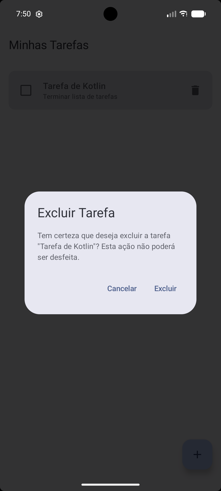
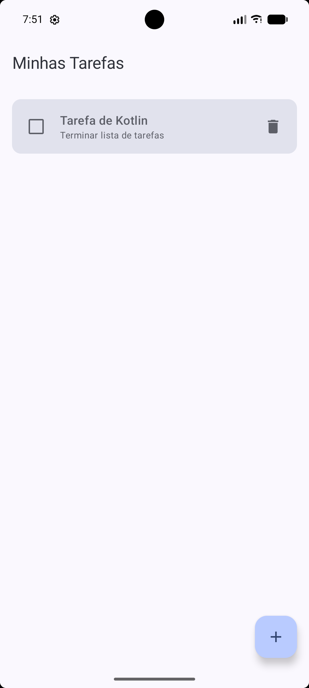
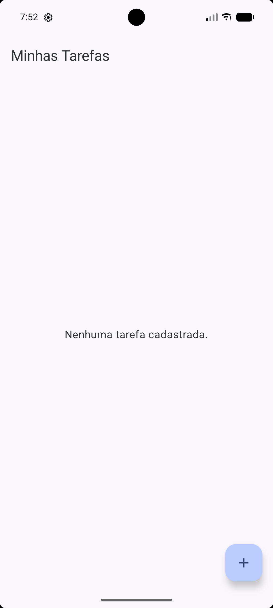

# Evidências de implementação - Confirmação de exclusão de tarefas

Este arquivo documenta a sequência de validações no emulador referentes ao fluxo seguro de exclusão de tarefas.

### 1. Lista antes da exclusão
Lista inicial exibindo as tarefas cadastradas.

  

### 2. Diálogo aberto com a tarefa selecionada
Diálogo de confirmação aberto exibindo o título da tarefa selecionada.

  

### 3. Resultado ao cancelar
Ao tocar em "Cancelar", o diálogo fecha e a lista permanece inalterada.

  

### 4. Nova abertura do diálogo
Reabertura do diálogo de confirmação.

  

### 5. Resultado após confirmar a exclusão
Ao clicar em "Excluir", apenas a tarefa selecionada é removida e o diálogo fecha.

  

