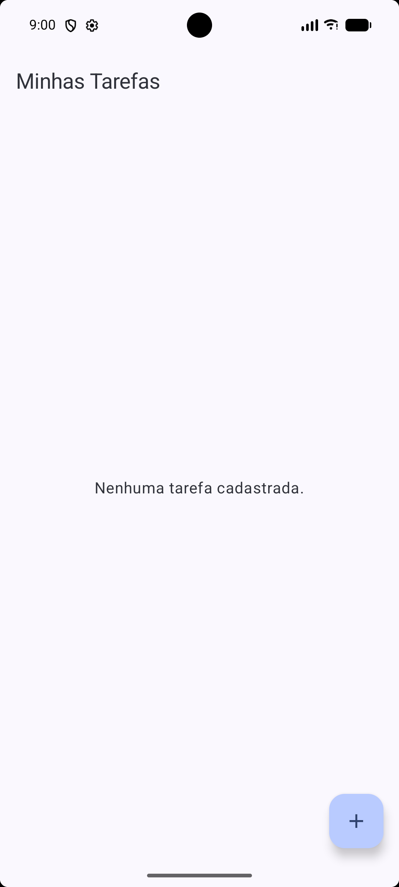
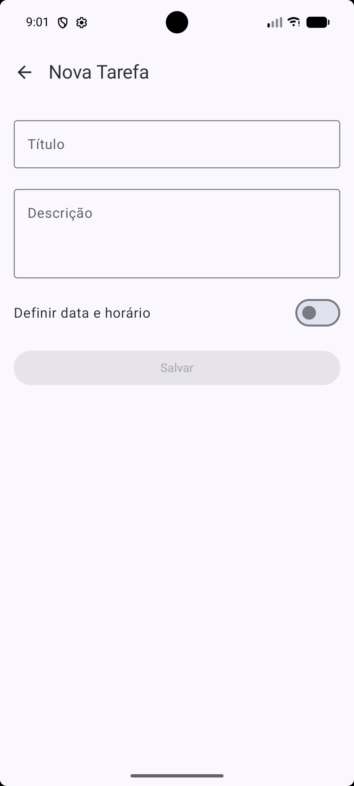
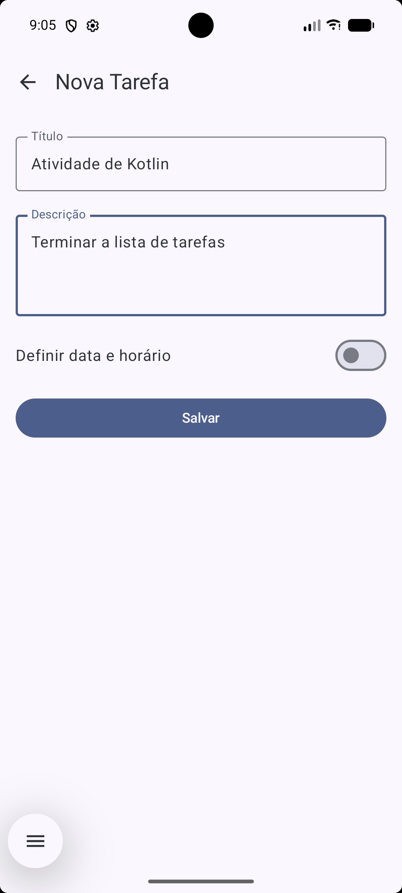
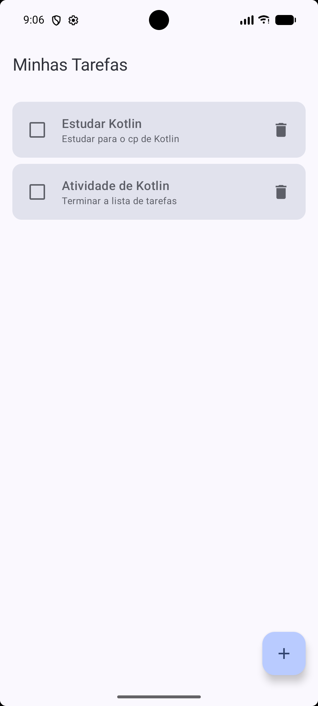
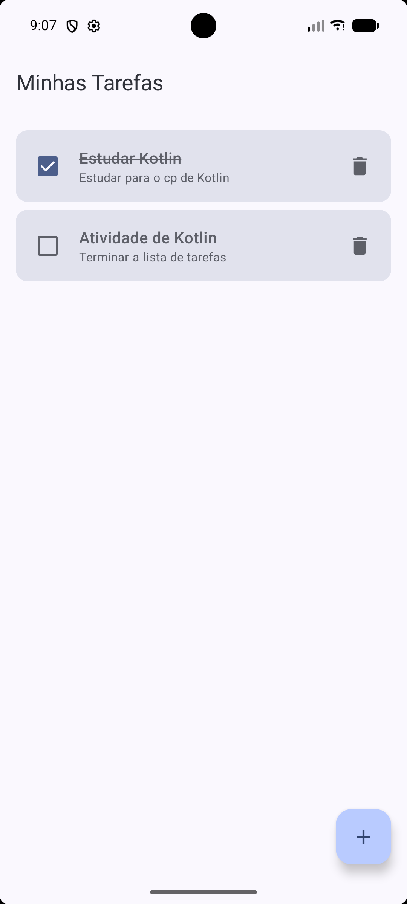
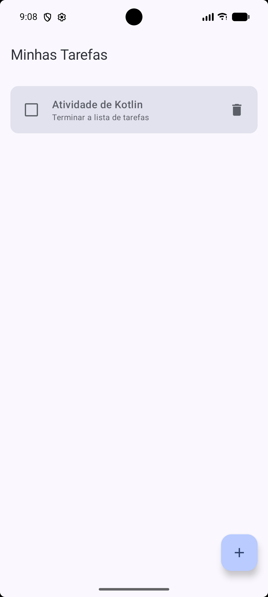
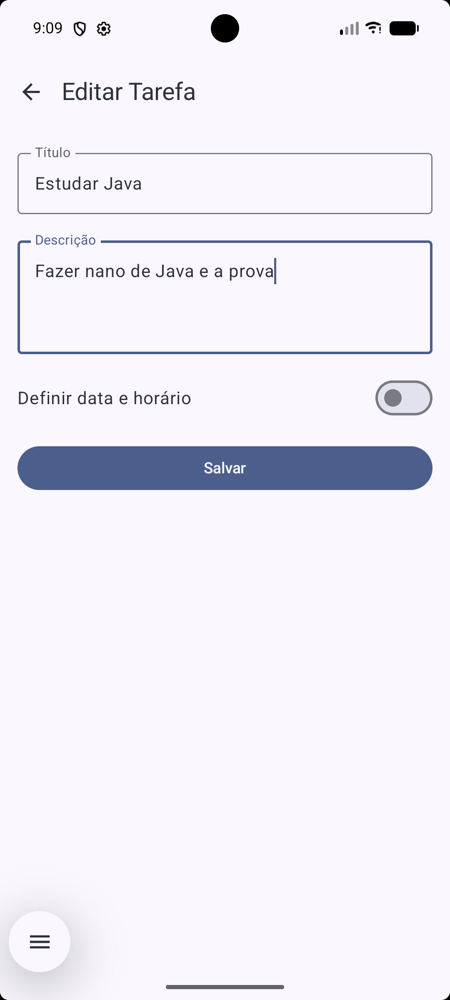
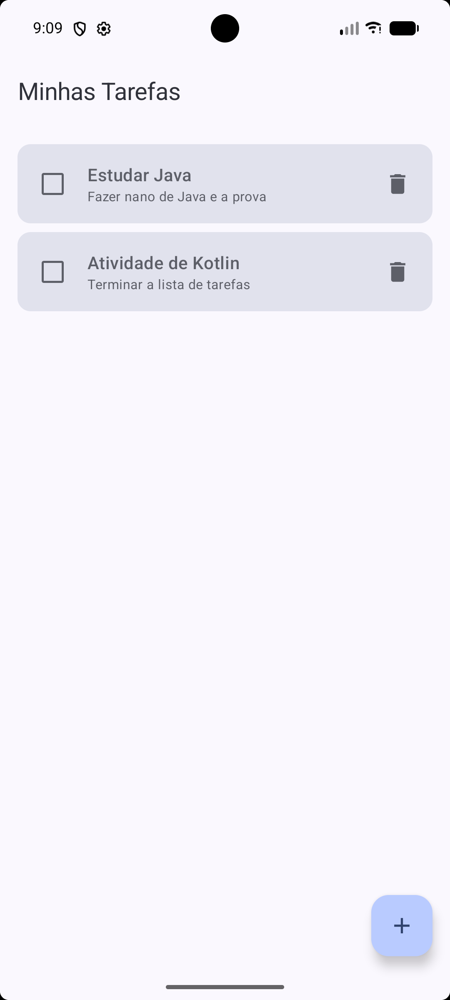

# Lista de tarefas
Este é um aplicativo Android de lista de tarefas (to-do list) desenvolvido como projeto didático. O objetivo da aplicação é permitir que os usuários gerenciem suas tarefas de forma simples e eficiente, oferecendo funcionalidades para criar, editar, excluir, marcar tarefas como concluídas. 

Os dados possuem persistência local, garantindo que as tarefas continuem salvas no dispositivo mesmo após o aplicativo ser fechado.

---

## Tecnologias utilizadas
O projeto foi construído utilizando as seguintes tecnologias e bibliotecas do Android:
* **Kotlin:** linguagem de programação principal.
* **Jetpack Compose:** toolkit moderno para construção da interface de usuário (UI) de forma declarativa.
* **Room:** biblioteca de persistência para abstração do banco de dados SQLite local.
* **Coroutines/Flow:** gerenciamento de tarefas assíncronas e fluxos de dados reativos.
* **ViewModel:** gerenciamento de dados relacionados à UI e ciclo de vida.
* **Navigation Compose:** navegação entre as telas (composables) do aplicativo.

---

## Arquitetura e implementação

O projeto adota o padrão arquitetural **MVVM (Model-View-ViewModel)**, separando as responsabilidades de dados, lógica de apresentação e interface de usuário.

### TarefaRepository
* O `TarefaRepository` atua na camada de Model e é a única fonte de verdade (*Single Source of Truth*) para os dados das tarefas.
* Sua responsabilidade é abstrair a origem dos dados (neste caso, o banco de dados local via DAOs do Room). 
* Ele fornece métodos limpos para inserção, atualização, exclusão e listagem de tarefas, ocultando a complexidade do banco de dados da ViewModel.

### TarefaViewModel
* A `TarefaViewModel` gerencia o estado da interface (UI State) e a lógica de negócios da aplicação.
* Ela se comunica com o `TarefaRepository` para buscar ou persistir dados, utilizando **Coroutines** para realizar essas operações de forma assíncrona, sem bloquear a thread principal. 
* Além disso, ela expõe os dados formatados (utilizando **Flow/StateFlow**) para que a interface de usuário possa observá-los e reagir a mudanças.

### ListaTarefasScreen
* A `ListaTarefasScreen` é uma tela reativa. Ela observa os fluxos de dados expostos pela `TarefaViewModel` (como a lista de tarefas) utilizando funções como `collectAsState()`. 
* Quando o estado na ViewModel muda (por exemplo, uma nova tarefa é adicionada), a tela é automaticamente recomposta (re-renderizada) para refletir a alteração. 
* As ações do usuário, como clicar no botão para concluir ou excluir uma tarefa, são disparadas invocando funções de callback (eventos) expostas pela própria ViewModel.

### FormularioTarefaScreen
* A `FormularioTarefaScreen` utiliza o ID da tarefa para entender seu contexto. Quando a tela é aberta, ela verifica o ID recebido:
  * Se o ID não for passado ou for equivalente a zero (ou um valor nulo/default), a tela entende que é uma operação de **cadastro**, exibindo os campos em branco.
  * Se um ID válido for recebido, a tela entende que é uma operação de **edição**. Nesse caso, ela aciona a ViewModel para carregar os dados da tarefa correspondente no banco de dados e preenche os campos do formulário para que o usuário possa alterá-los.

### AppNavigation
* O `AppNavigation` é responsável por configurar o grafo de navegação do aplicativo usando o **Navigation Compose**. 
* Ele define rotas em formato de string para as telas, como `"lista"` para a tela principal e `"formulario?tarefaId={tarefaId}"` para a tela de formulário. 
* A passagem de parâmetros é feita diretamente na rota. Ao clicar em uma tarefa para editá-la, o ID é concatenado na rota (ex: `"formulario?tarefaId=5"`). 
* O componente de navegação extrai esse argumento da URL e o repassa como parâmetro para a `FormularioTarefaScreen`.

### MainActivity
* A `MainActivity` atua como o ponto de entrada e o local onde as dependências principais são instanciadas (já que o projeto não utiliza frameworks de injeção de dependência como Hilt/Koin). 
* Primeiro, ela inicializa o banco de dados do Room e cria a instância do `TarefaRepository`. 
* Em seguida, utiliza uma `ViewModelProvider.Factory` customizada para injetar o repositório e criar a instância da `TarefaViewModel`. 
* Por fim, a `MainActivity` chama o `AppNavigation`, passando essa mesma instância da ViewModel, o que garante que ambas as telas (Lista e Formulário) compartilhem exatamente os mesmos dados e estado.

---

## Como executar o projeto

1. Clone o repositório para a sua máquina local.
2. Abra o projeto utilizando o **Android Studio**.
3. Aguarde o Android Studio realizar a sincronização do Gradle (download de dependências).
4. Configure um emulador Android ou conecte um dispositivo físico com depuração USB ativada.
5. Clique no botão **Run (▶)** na barra superior do Android Studio.

---

## Evidências

Abaixo estão as capturas de tela das funcionalidades desenvolvidas durante a atividade:

*(Imagens demonstrando as funcionalidades de listagem, cadastro, edição e remoção de tarefas, incluindo os respectivos formulários.)*

  
  &nbsp;&nbsp;&nbsp;
  
  &nbsp;&nbsp;&nbsp;
  
  &nbsp;&nbsp;&nbsp;
  
  &nbsp;&nbsp;&nbsp;
  
  &nbsp;&nbsp;&nbsp;
  
  &nbsp;&nbsp;&nbsp;
  
  &nbsp;&nbsp;&nbsp;
  
  &nbsp;&nbsp;&nbsp;

